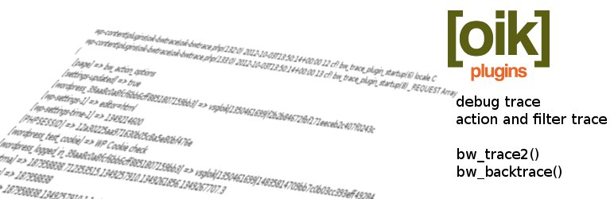

# oik-bwtrace 

* Contributors: bobbingwide, vsgloik
* Donate link: https://www.oik-plugins.com/oik/oik-donate/
* Tags: debug, trace, backtrace, ad hoc tracing
* Requires at least: 5.0
* Tested up to: 6.9
* Gutenberg compatible: Yes
* Requires PHP: 5.6
* Stable tag: 4.2.0-RC1
* License: GPLv2 or later
* License URI: http://www.gnu.org/licenses/gpl-2.0.html

Debug trace for WordPress, including ad hoc action hook and filter tracing.

## Description 

* The primary purpose of debug trace is to help in the development of PHP code: plugins or themes.
* The primary purpose of action trace is to help you understand the sequence of events in the server.
* The primary purpose of ad hoc tracing is to let you see what's happening without changing any code.
* The primary purpose of 'string watch' is to track the source of some output.
* This plugin provides the admin interface to trace functions and methods and action and filter tracing.

oik bwtrace does not alter the output of your web pages though there are options
which cause some output to be written to the browser during 'shutdown' processing.

You can also use the oik trace facilities to assist in problem determination in a live site.
Output is written to files on the server in a user defined trace files directory.
When tracing a live or staging site you should ensure that the trace files directory is not publicly accessible.

Features:

* Traces to a defined Trace files directory
* Traces ALL server functionality, including AJAX, REST and other background requests
* Writes summary trace record for each transaction into Daily Trace summary files
* Traces browser transactions separately, if required
* Traces AJAX transactions separately, if required
* Traces REST requests separately, if required
* Traces CLI requests separately, if required
* Ability to choose the IP address to trace, defaults to ALL requests
* Supports ad hoc tracing of user defined hooks
* Action trace counts help you understand the sequence of actions and filters
* Provides contextual information
* Minimum performance overhead when tracing is not enabled
* Tracing can be enabled programmatically
* Traces and backtraces PHP Error, Warning and Notice messages
* Backtraces deprecated logic messages
* Does not require WP_DEBUG to be defined
* Does not require SAVEQUERIES to be defined
* Dynamically activates trace functions
* Implemented as lazy just-in-time code
* Can be used during regression testing
* Can be activated in wp-config.php and db.php to trace code before WordPress is fully loaded
* Plugin does not need to be activated if started programmatically or from wp-config.php
* Operates as a standalone plugin
* Integrated with oik-lib shared library management
* Easy to code APIs: bw_trace2(), bw_backtrace().
* API supports multiple trace levels

Ad hoc tracing allows you to:

* trace parameters
* trace results
* trace registered functions
* trace the global post
* set the priority for the trace hook
* debug backtrace hook invocation
* perform 'string watch' to watch for a particular string

The trace record output can include:

* Fully qualified source file name
* Trace record count and trace error count
* Time stamp
* Current filter information
* Hook count
* Number of database queries that have been performed.
* Current post ID
* Current and peak memory usage (in bytes)
* Files loaded count
* Contextual information

The output for action tracing can include trace records showing:

* Count of action hooks and filters
* Invocation of the 'wp' actions
* Contents of the global wp_rewrite for the 'wp' action
* Summary reports at 'shutdown'
* Information about deprecated logic
* Information related to Errors, Warnings and Notices

New in v3.4.0

* Experimental Performance trace option
* Experimental front end links to trace file and daily trace summary

## Installation 
1. Upload the contents of the oik-bwtrace plugin to the `/wp-content/plugins/oik-bwtrace' directory
1. Activate the oik-bwtrace plugin through the 'Plugins' menu in WordPress
1. Define your trace options using Settings > oik trace options
1. Define your action trace options using Settings > oik action options
1. Don't forget to disable tracing when you no longer need it
1. Don't forget to purge the trace output when you no longer need it

## Frequently Asked Questions 

# Where is the FAQ? 
[oik-bwtrace FAQ](https://www.oik-plugins.com/oik-plugins/oik-bwtrace-debug-trace-for-wordpress/?oik-tab=faq)

# Where is the documentation? 
[oik-bwtrace - debug trace for WordPress](https://www.oik-plugins.com/wordpress-plugins-from-oik-plugins/free-oik-plugins/oik-trace-plugin/)

## Is there a tutorial? 
See this page and short video
[Introduction to oik-bwtrace](https://www.oik-plugins.com/wordpress-plugins-from-oik-plugins/free-oik-plugins/oik-trace-plugin/an-introduction-to-problem-determination-with-oik-bwtrace-debug-trace-for-wordpress)

# Can I get support? 
Use the contact form on the oik-plugins website.

# How can I contribute? 
https://github.com/bobbingwide/oik-bwtrace

## Screenshots 
1. Trace files directory box
2. Trace options - Requests sections
3. Trace options - Trace records
4. Daily Trace Summary box
5. Action options - Options
6. Action options - Ad hoc tracing
7. Trace information box
8. Raw trace output
9. Daily Trace Summary file

## Upgrade Notice 
# 4.2.0-RC1 
Upgrade for improved accessibility.

## Changelog 
# 4.2.0-RC1 
* Changed: Improve a11y - use grid layout for forms #122
* Changed: Update tests for a11y #122 and postbox improvements oik#81
* Changed: Improve a11y. #122 Changed: Disable postbox save oik#81
* Changed: Improve a11y of oik_menu_header() and oik_box() #122
* Changed: Improve a11y for icheckbox() #122
* Update tests for a11y changes to select and textarea #122
* Changed: a11y: reconcile updates to bobbforms for accessibility #122
* Changed: Comment change #116
* Changed: A11y improvements #122
* Tested: With WordPress 6.9 and WordPress Multisite
* Tested: With PHPUnit 10 & 11
* Tested: With PHP 8.3 and PHP 8.4

## Further reading 
If you want to read more about the oik plugins then please visit the
[oik plugin](https://www.oik-plugins.com/oik)
**"the oik plugin - for often included key-information"**
